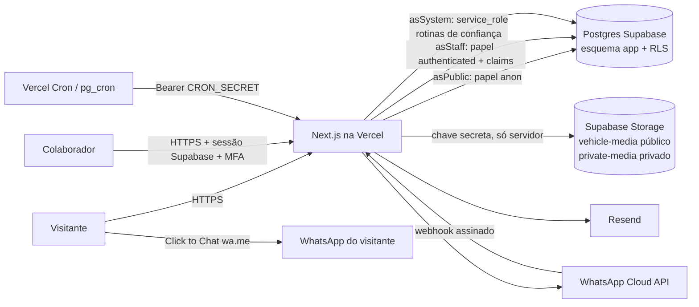
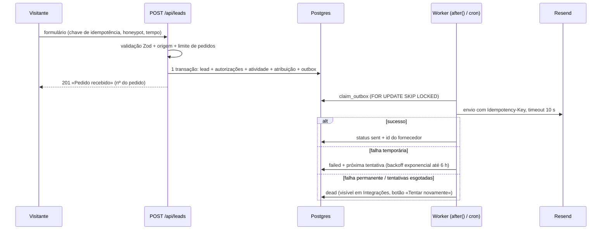
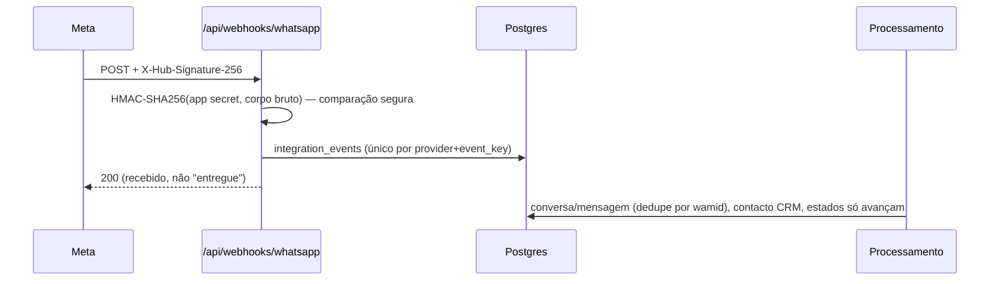

# Arquitetura

- O esquema `app` **não** é exposto pela Data API da Supabase; o servidor liga-se ao Postgres
  pelo *transaction pooler* e muda de papel em cada transação (`set local role`). Assim, as
  políticas RLS aplicam-se também ao código do servidor, não só a chamadas diretas.
- Leituras públicas usam o papel `anon` com permissões por coluna (VIN, matrícula, custos e notas
  ficam em `vehicle_private_details`, inacessível a `anon` e a vendedores).

## Fluxo de um pedido e notificações

O pedido fica sempre no painel, mesmo que o email falhe. O visitante vê a receção do pedido,
nunca uma promessa de entrega de email.

## WhatsApp

